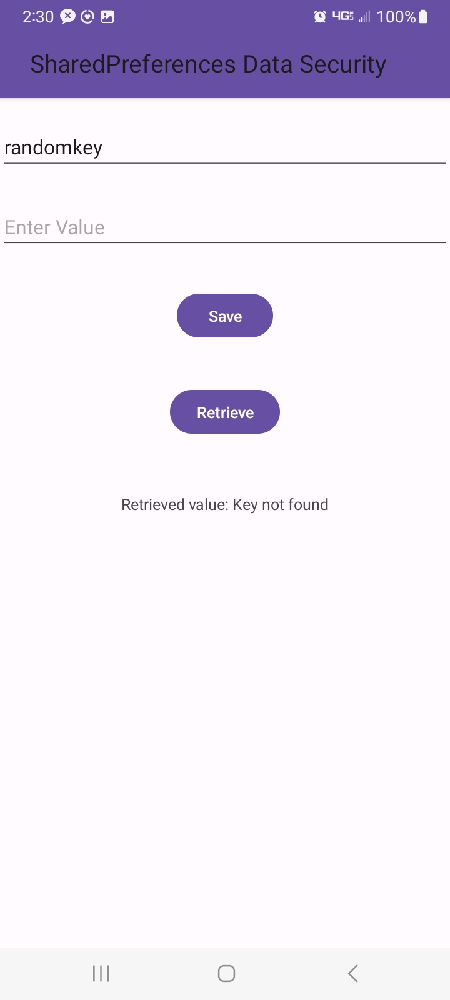

Here by using EncryptedSharedPreferences class from the Jetpack Security library in Android, the data stored in the SharedPreferences file is encrypted. It uses 
encryption schemes for both the keys and values. The key encryption scheme is set to AES256_SIV, and the value encryption scheme is set to AES256_GCM, which 
are strong encryption algorithms. As a result, even if someone gains access to the SharedPreferences xml file, the data will be in encrypted form. Additional
security layers can be added for more sensitive data.  
 

